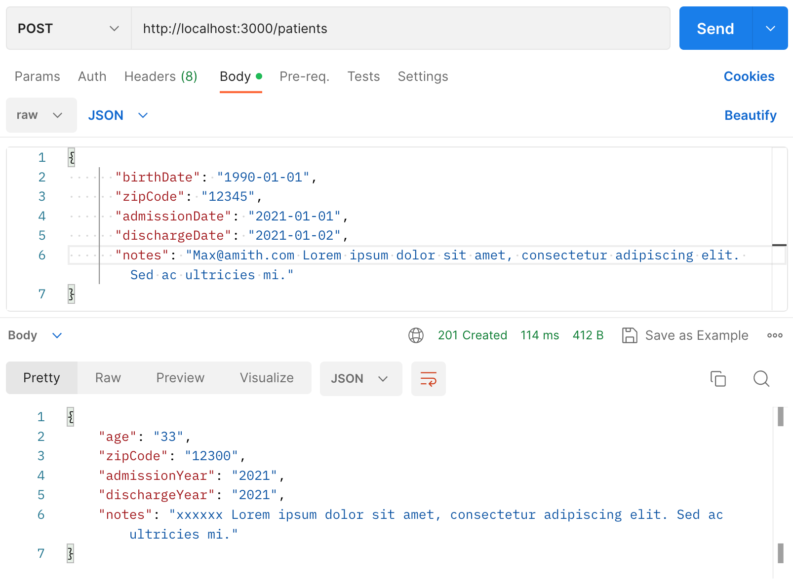
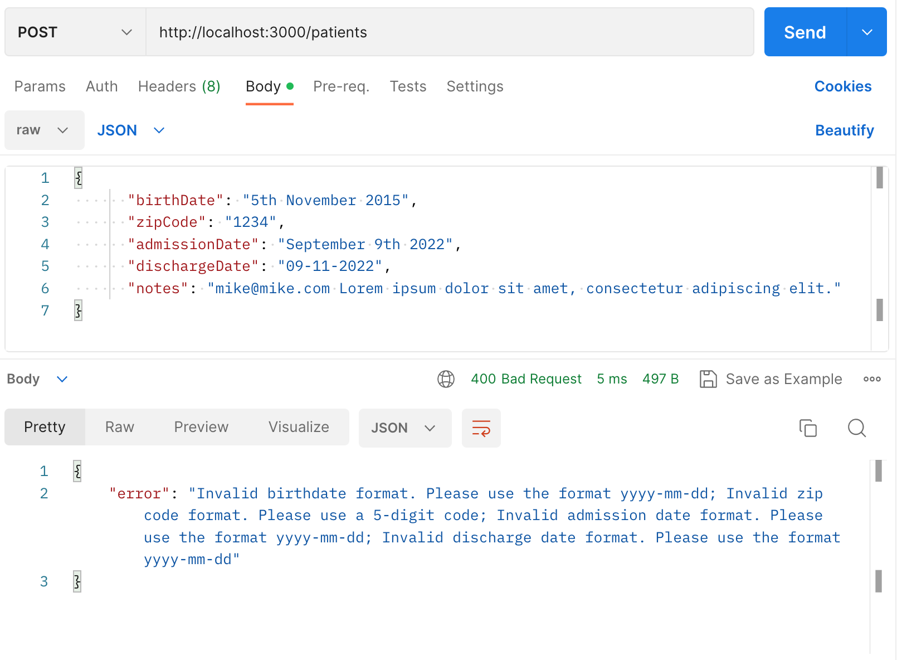
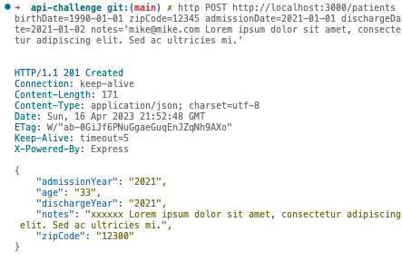
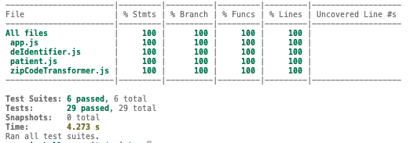

# Elsevier Api-Challenge Tech Test #

**This is my attempt at a tech test designed to vet the technical ability of software engineers applying to Elsevier. The link to the test is [here](https://github.com/elsevierPTG/interviews/tree/master/api-challenge). The specifications are below**

### [Introduction](#Introduction) | [My Approach to the Test](#My_approach_to_the_test) | [Results](#results) | [Testing](#testing) | [Installation](#installation) 

# Safe Harbor De-Identification

## Introduction

In the United States, the privacy of patient data is governed by the Health
Insurance Portability and Accountability Act, or as it's commonly known, HIPAA.
One regulation falling under HIPAA is the Privacy Rule, which, among other
things, governs what health data can be shared and under what circumstances.
Researchers in health fields often seek out "Limited Data Sets", which have been
stripped of 18 types of data, including biometrics such as fingerprints, birth
dates, telephone numbers, social security numbers, etc.  This process is known
as 'Safe Harbor' de-identification.

For this assessment, we're going to write a real-time de-identification engine,
which is a buzzwordy way of saying we're going to build a simple API which takes
in a single patient record as JSON, and returns a de-identified version.  We're
not going to try to implement all 18, but rather the following rules.

## Problem Statement

Write an API that exposes an endpoint for the de-identification of patient
records. Specifically, we're looking for the following:

* Birthdates should be converted to the patient's age.  If someone is over the age
  of 89, they should be lumped into a 90+ category.

* ZIP Codes should be stripped to the first three digits _except_ where fewer
  than 20,000 people reside in the combination of all ZIP codes with those three
  digits. In this case, the ZIP Code should be set to 00000.  A file with ZIP
  codes and their populations is included in CSV format.  Note that these are
  Zip Code Tabulation Areas (ZCTAs) which exclude certain ZIP codes which are
  not useful for population data (i.e. some office buildings have their own ZIP
  codes due to mail volume, but are not considered for census tabulation).

* Admission and Discharge dates should be set to the year only.

* The notes section should replace anything that looks like an email address,
  US social security number, or a US telephone number with sensible
  replacements.  Any dates in the notes section should be replaced with the
  year.

You may assume that names, pictures, etc. will not occur in the data. You can
assume data is reasonably well formed (i.e. no one will try to pass a date as a
zip code) but the server should ideally not crash if it encounters an edge case.

## Sample Inputs and Outputs

A sample input of:

```
{
    "birthDate": "2000-01-01",
    "zipCode": "10013",
    "admissionDate": "2019-03-12",
    "dischargeDate": "2019-03-14",
    "notes": "Patient with ssn 123-45-6789 previously presented under different ssn"
}
```

Should yield output of:

```
{
    "age": "20",
    "zipCode": "10000",
    "admissionYear": "2019",
    "dischargeYear": "2019",
    "notes": "Patient with ssn XXX-XX-XXXX previously presented under different ssn"
}
```

## **My approach to the test** ##

* Created a [design document]('/Users/davidscott/Projects/api-challenge/design/design.md') in which I built user stories, diagrammed out the api and classes and wrote test examples.
* Decided to use TDD my solution using JavaScript and Jest.
* Created unit tests for each of the classes carrying out the logic of the deidentification, separating out Patient data, the deidentification process and the zipcode transformation, which was itself a more complex procedure.
* Created unit test and integration tests for the API.
* Refactored
* Demo-ed solution using Postman and HTTPie.


## **Results** ##

* My solution works consistently with all tests passing and 100% coverage.
* It took longer than the hour timeframe given in the specification but the I TDD-ed the whole system and I think this is where the extra work came in.

### Postman ###





### HTTPie ###




### Testing was carried out using jest. ###
All tests pass with a 100% coverage.



## **Installation** ##
This guide assumes you have Node.js installed.
* Initialise a new Node.js project
```
npm init
```
* Install the Express.js framework and its dependencies.
```
npm install express
```
* Install Jest and the Esbuild JavaScript bundler globally on your system. 

```
npm install -g jest esbuild
```

* Install the JSDOM environment for Jest
```
npm install jest-environment-jsdom
```
* Install the Jest Fetch Mock library.
```
npm install --save jest-fetch-mock
```
* Install the PapaParse library, which is a powerful CSV parsing and processing library for JavaScript.
```
npm install papaparse
```

* To use, install Postman - https://www.postman.com/downloads/

* And/or install HTTPie - https://httpie.io/download
