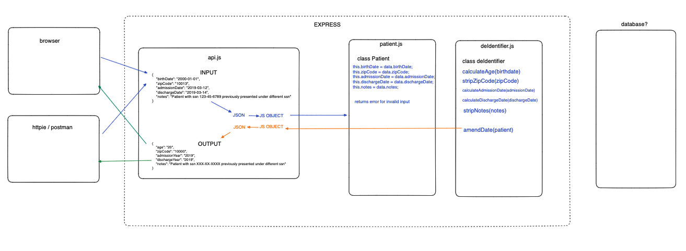
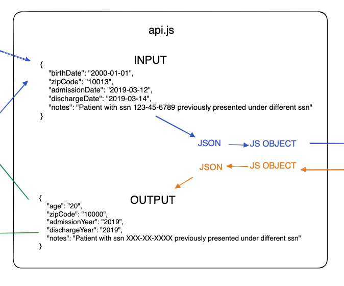
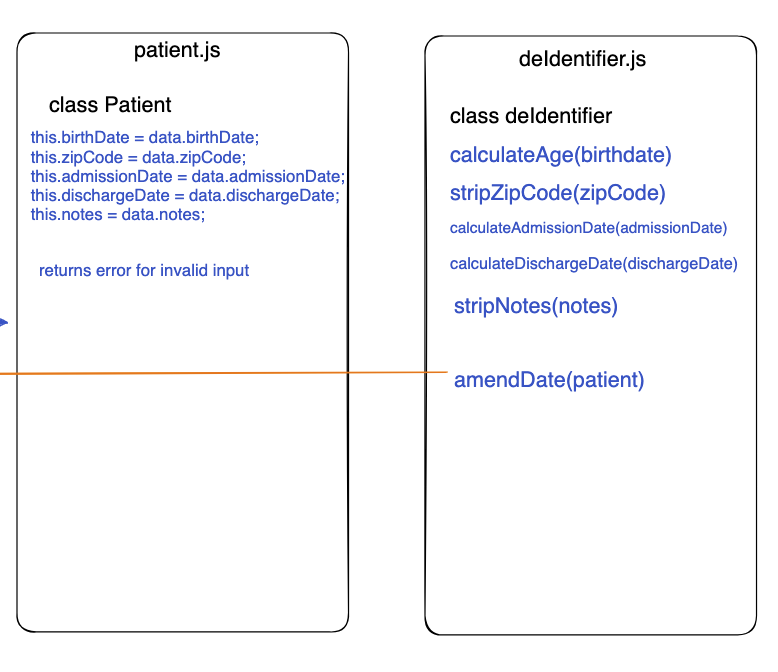

### USER STORIES
- As a medical professional, I want to be able to use an API to de-identify patient records so that the privacy of my patients is protected.
- As a medical professional, I want patient birthdates to be converted to their age so that I can easily determine their age without revealing their exact birthdate.
- As a medical professional, I want patients who are over the age of 89 to be categorized as 90+ so that their exact age is not revealed.
- As a medical professional, I want to be able to strip ZIP codes to the first three digits so that patient location can be somewhat generalized without revealing their exact location.
- As a medical professional, I want to be able to set ZIP codes to 00000 if fewer than 20,000 people reside in the combination of all ZIP codes with those three digits so that patient location can be even more generalized.
- As a medical professional, I want admission and discharge dates to be set to the year only so that specific dates are not revealed, further protecting patient privacy.
- As a medical professional, I want the notes section to replace email addresses, US social security numbers, and US telephone numbers with sensible replacements so that sensitive information is not revealed.
- As a medical professional, I want the notes section to replace dates with the year so that specific dates are not revealed, further protecting patient privacy.
- As a developer, I want the API to handle edge cases gracefully so that it does not crash or cause issues with the patient records









## Patient Class Test Examples


### INPUT 1

```
const patientData = {
    birthDate: "2000-01-01",
    zipCode: "10013",
    admissionDate: "2019-03-12",
    dischargeDate: "2019-03-14",
    notes: "Patient with ssn 123-45-6789 previously presented under different ssn"
};

const newPatient = new Patient(patientData)

```


### OUTPUT 1
```

expect(newPatient.birthDate).toBe("2000-01-01")
expect(newPatient.zipCode).toBe("10013")
expect(newPatient.admissionDate).toBe("2019-03-12")
expect(newPatient.dischargeDate).toBe("2019-03-14")
expect(newPatient.notes).toBe("Patient with ssn 123-45-6789 previously presented under different ssn")
```


### INPUT 2
```
const invalidPatientData = {
    birthDate: "24th March 1981",
    zipCode: "E12ND",
    admissionDate: "5-11-2020",
    dischargeDate: "bananas",
    notes: "Patient was admitted 5th November 2020"
}

const newPatient = new Patient(invalidPatientData)

```
### OUTPUT 2

```
expect(patient).toEqual({
  error: "Invalid birthdate format. Please use the format yyyy-mm-dd; Invalid zip code format. Please use a 5-digit code; Invalid admission date format. Please use the format yyyy-mm-dd; Invalid discharge date format. Please use the format yyyy-mm-dd"
})
```


## DeIdentifier Class TEST EXAMPLES

### INPUT 1
```
{
    birthDate: "2000-01-01",
    zipCode: "10013",
    admissionDate: "2019-03-12",
    dischargeDate: "2019-03-14",
    notes: "Patient with ssn 123-45-6789 previously presented under different ssn"
}
```

### OUTPUT 1

```
{
    age: "23",
    zipCode: "10000",
    admissionYear: "2019",
    dischargeYear: "2019",
    notes: "Patient with ssn XXX-XX-XXXX previously presented under different ssn"
}
```

### INPUT 2
```
{
    birthDate: "1933-01-01",
    zipCode: "55607",
    admissionDate: "2009-04-12",
    dischargeDate: "2009-06-14",
    notes: "Patient can be contacted on MrsBarbaraSmith@aol.com"
}
```

### OUTPUT 2

```
{
    age: "90+",
    zipCode: "00000", 
    admissionYear: "2009",
    dischargeYear: "2009",
    notes: "Patient can be contacted on xxxxxx@xxxxxx"
}
```


### INPUT 3
```
{
    "birthDate: "1975-03-24",
    "zipCode: "55720",
    "admissionDate: "2015-06-17",
    "dischargeDate: "2015-06-18",
    "notes: "Patient was admitted 2015-06-17, their cellphone is: (555) 555-1234"
}
```

### OUTPUT 3

```
{
    age: "48",
    zipCode: "55700", 
    admissionYear: "2015",
    dischargeYear: "2015",
    notes: "Patient was admitted 2015, their cellphone is: (XXX) XXX-XXXX"
}
```

### INPUT 4
```
{
    birthDate: "2005-07-16",
    zipCode: "12144",
    admissionDate: "2020-11-5",
    dischargeDate: "2020-11-7",
    notes: "Patient was admitted 5th November 2020"
}
```

### OUTPUT 4

```
{
    age: "48",
    zipCode: "55700", 
    admissionYear: "2015",
    dischargeYear: "2015",
    notes: "Patient was admitted 2020"
}
```


